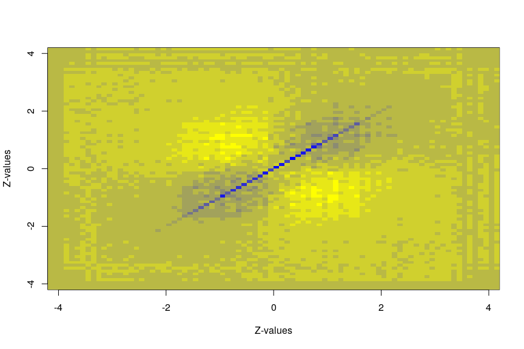

Introduction
============

Dependence between test statistic is known to render the fasle discovery proportion more variable. This is caused by the greater sampling variability of the test statistics under dependence. The aim of this *reconsi* pacakage is to provide REsampling COllapsed Null distributions for Simultaneous Inference to estimate the null density functions more precisely for improved inference. It can reduce the variability of the false discovery proportion, while increasing the sensitivity. Many types of test statistic can be supplied, but only Wilcoxon rank sum test and two sample t-test are natively implemented. Both **permutations** and **bootstrapping** are implemented.

A short tutorial is given here, more detailed instructions can be found in the vignette.

Installation
============

The package can be installed using the following commands:

``` r
library(devtools)
install_github("CenterForStatistics-Ugent/reconsi")
```

and loaded as

``` r
library(reconsi)
```

General use
===========

We illustrate the general use of the package on a synthetic dataset. The default Wilcoxon rank-sum test is used.

``` r
# Create some synthetic data with 90% true null hypotheses
p = 200
n = 50
x = rep(c(0, 1), each = n/2)
mat = cbind(matrix(rnorm(n * p/10, mean = 5 + x), n, p/10), matrix(rnorm(n * 
    p * 9/10, mean = 5), n, p * 9/10))
# Provide just the matrix and grouping factor, and test using the collapsed
# null
fdrRes = reconsi(mat, x)
# The estimated tail-area false discovery rates.
estFdr = fdrRes$Fdr
```

The method provides an estimate of the proportion of true null hypothesis, which is close to the true 90%.

``` r
fdrRes$p0
```

    ## [1] 0.8751848

The result of the procedure can be represented graphically as follows:

``` r
plotNull(fdrRes)
```

![Illustration of the estimation of the collapsed null distribution through resampling. The observed test statistics are shown as a green histogram. The resampling null candidates are plotted as dashed curves, with their colour indicating how much they contribute to the estimation of the collapsed null distribution. This estimated collapsed null density is shown as a solid curve. The standard normal density is shown as a dashed black line as a reference. The red dots represent observed test statistic, their height reflects their estimated tail-area false discovery rate. The black dot-dashed line is the estimated local false discoery rate.](README_figs/README-plotNull-1.png)

It is also possible to provide a custom test function, which must accept at least a 'y' response variable and a 'x' grouping factor. Additionally, a distribution function should be supplied for the transformation to z-values.

``` r
# Define a custom test function
testFun = function(x, y) {
    fit = lm(y ~ x)
    c(summary(fit)$coef["x", "t value"], fit$df.residual)
}
# Supply it to the reconsi algorithm
fdrResLm = reconsi(mat, x, B = 50, test = testFun, distFun = function(q) {
    pt(q = q[1], df = q[2])
})
```

Case study
----------

We illustrate the package using an application from microbiology. The species composition of a community of microorganisms can be determined through sequencing. However, this only yields compositional information, and knowledge of the population size can be acquired by cell counting through flow cytometry. Next, the obtained species compositions can multiplied by the total population size to yield approximate absolute cell counts per species. Evidently, this introduces strong correlation between the tests due to the common factor. In other words: random noise in the estimation of the total cell counts will affect all hypotheses. Also biological interactions between the species (e.g. due to competition or crossfeeding) can cause the outcome values to be correlated. Therefore, we employ permutations to estimate the collapsed null distribution, that will account for this dependence.

The dataset used is taken from Vandeputte *et al.*, 2017 (see [manuscript](https://www.ncbi.nlm.nih.gov/pubmed/29143816)), a study on gut microbiome in healthy and Crohn's disease patients. The test looks for differences in absolute abundance between healthy and diseased patients. It relies on the [phyloseq](https://bioconductor.org/packages/release/bioc/html/phyloseq.html) package, which is the preferred way to interact with our machinery for microbiome data.

``` r
# The grouping and flow cytometry variables are present in the phyloseq
# object, they only need to be called by their name.
testVanDePutte = testDAA(Vandeputte, groupName = "Health.status", FCname = "absCountFrozen", 
    B = 100L)
```

The estimated tail-area false discovery rates can then simply be extracted as

``` r
FdrVDP = testVanDePutte$Fdr
quantile(FdrVDP)
```

    ##           0%          25%          50%          75%         100% 
    ## 1.554661e-18 1.455041e-02 3.015831e-01 7.276982e-01 8.680592e-01

An approximation of the correlation matrix of the test statistics can be drawn as follows:

``` r
plotApproxCovar(testVanDePutte)
```



This is the correlation matrix of binned test statistics, whereby yellow indicates negative correlations between bin counts and blue positive correlations. Each pixel represents a combination of two bins. It is clear that counts in the left and right tail are negatively correlated, and bin counts close together are positively correlated.
