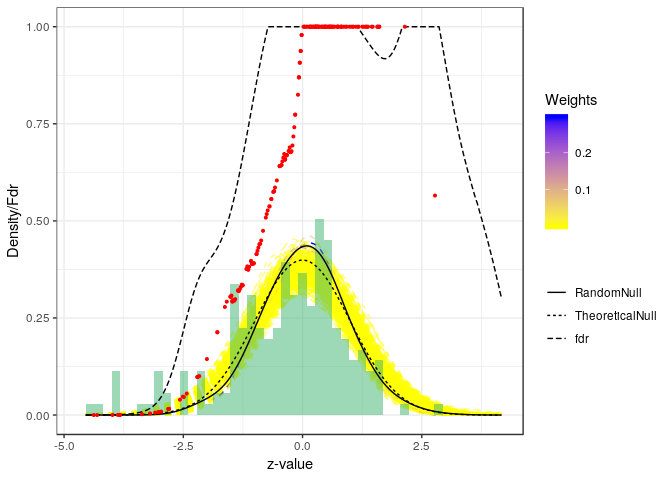

``` r
library(corTests)
```

Manual for the use of the corTest functions
===========================================

Introduction
------------

The aim of this pacakage is to provide simultenous inference for correlated hypotheses using random null distributions. These random null distributions are estimated through permutations. Wilcoxon rank sum test and two sample t-test are natively implemented, but any other test can be used.

General use
-----------

We illustrate the general use of the package on a synthetic dataset. The default Wilcoxon rank-sum test is used.

``` r
#Create some synthetic data with 90% true null hypothesis
 p = 200; n = 50
x = rep(c(0,1), each = n/2)
 mat = cbind(
 matrix(rnorm(n*p/10, mean = 5+x),n,p/10), #DA
 matrix(rnorm(n*p*9/10, mean = 5),n,p*9/10) #Non DA
 )
 #Provide just the matrix and grouping factor, and test using the random null
 fdrRes = fdrCorrect(mat, x)
  #The estimated tail-area false discovery rates.
  estFdr = fdrRes$Fdr
```

The method provides an estimate of the proportion of true null hypothesis, which is close to the true 90%.

``` r
fdrRes$p0
```

    ## [1] 0.8771698

The result of the procedure can be represented graphically as follows:

``` r
plotNull(fdrRes)
```



It is also possible to provide a custom test function, which must accept at least a 'y' response variable and a 'x' grouping factor. Additionally, a quantile function should be supplied for transformation through quantiles to z-values.

``` r
 #With another type of test
fdrResLm = fdrCorrect(mat, x, B = 5e1,
                      test = function(x, y){
fit = lm(y~x)
c(summary(fit)$coef["x1","t value"], fit$df.residual)},
quantileFun = function(q){pt(q = q[1], df = q[2])})
```

This framework also accepts more than 2 groups, and additional covariates through the

``` r
 #3 groups
 p = 100; n = 60
x = rep(c(0,1,2), each = n/3)
 mat = cbind(
 matrix(rnorm(n*p/10, mean = 5+x),n,p/10), #DA
 matrix(rnorm(n*p*9/10, mean = 5),n,p*9/10) #Non DA
 )
 #Provide an additional covariate through the 'argList' argument
 z = rpois(n , lambda = 2)
 fdrResLmZ = fdrCorrect(mat, x, B = 5e1,
 test = function(x, y, z){
 fit = lm(y~x+z)
 c(summary(fit)$coef["x1","t value"], fit$df.residual)},
 quantileFun = function(q){pt(q = q[1], df = q[2])},
 argList = list(z = z))
```

If the null distribution of the test statistic is not known, it is also possbile to execute the procedure on the scale of the original test statistics, rather than z-values by setting zValues = FALSE. This may be numerically less stable.

``` r
fdrResKruskal = fdrCorrect(mat, x, B = 5e1,
test = function(x, y){
 kruskal.test(y~x)$statistic}, zValues = FALSE)
```

Case study
----------

We illustrate the package using an application from microbiology. The species composition of a community of microorganisms can be determined through sequencing. However, this only yields compositional information, and knowledge of the population size can be acquired by cell counting through flow cytometry. Next, the obtained species compositions can multiplied by the total population size to yield approximate absolute cell counts per species. Evidently, this introduces strong correlation between the tests due to the common factor. In other words: random noise in the estimation of the total cell counts will affect all hypotheses. Therefore, we employ permutations to estimate an experiment-specific random null distribution, that will account for this dependence.

The dataset used is taken from Vandeputte *et al.*, 2017 (see ), a study on gut microbiome in healthy and Crohn's disease patients. The test looks for differences in absolute abundance between healthy and diseased patients. It relies on the *phyloseq* package, which is the preferred way to interact with our machinery for microbiome data.

``` r
testVanDePutte = testDAA(Vandeputte, "Health.status", "absCountFrozen")
```

The estimated tail-area false discovery rates can then simply be extracted as

``` r
FdrVDP = testVanDePutte$Fdr
table(FdrVDP)
```

    ## FdrVDP
    ## 4.95008865169199e-16 5.03777974128808e-16 1.12260297115581e-15 
    ##                    1                    1                    1 
    ## 1.27945798670333e-15 1.30897474671501e-15 1.31230052869226e-15 
    ##                    1                    1                    1 
    ##  1.5310172834743e-15 1.53812597887805e-15 1.95586992892796e-15 
    ##                    1                    1                    2 
    ## 2.01150886331769e-15 2.04789907592708e-15 2.09708671484518e-15 
    ##                    1                    1                    1 
    ## 2.10397342726513e-15 2.10565348474071e-15 2.10799153392141e-15 
    ##                    1                    2                    1 
    ## 2.17654301343915e-15 2.21854854669345e-15 2.25273692251218e-15 
    ##                    1                    1                    1 
    ##  2.4565957321975e-15 2.61620606994498e-15 2.76912623416867e-15 
    ##                    1                    1                    1 
    ## 1.36615796443646e-14 4.83024985142979e-14 2.36774997323741e-13 
    ##                    1                    1                    1 
    ## 3.37997344766521e-13  5.4983006925287e-13 5.98022549027332e-13 
    ##                    1                    2                    1 
    ## 5.40676337188752e-12 8.41761204652414e-12 8.69819911474162e-12 
    ##                    2                    1                    1 
    ## 1.66792779515429e-10 5.43423645053634e-09 7.78285270400475e-09 
    ##                    1                    1                    1 
    ## 1.50144255390329e-08 1.99721313679254e-08 5.89588728502788e-08 
    ##                    1                    1                    1 
    ## 6.05523559002863e-08 9.63837789485178e-08 1.01656611033707e-07 
    ##                    1                    1                    1 
    ## 1.20475441457811e-07 1.89532840166332e-07 3.62233939606924e-07 
    ##                    1                    1                    1 
    ## 1.62727329405808e-06 1.66511685903617e-06 1.88587040450976e-06 
    ##                    1                    1                    1 
    ## 1.90471850394983e-06 2.17534891252454e-06 2.85454534925052e-06 
    ##                    1                    1                    1 
    ## 2.91528035668138e-06 7.20927318766823e-06 7.94166823170486e-06 
    ##                    1                    1                    1 
    ## 1.01052431079905e-05 1.07815082124087e-05 1.28782654997451e-05 
    ##                    1                    1                    1 
    ## 1.65230290429899e-05 3.08763779484774e-05 3.22749768687826e-05 
    ##                    1                    1                    1 
    ## 3.25476295215558e-05 4.63018980010945e-05 4.87283403488205e-05 
    ##                    1                    1                    1 
    ## 9.04173043944531e-05 9.86548334959835e-05 0.000110418452558556 
    ##                    1                    2                    1 
    ## 0.000433628992895715 0.000500000873869002  0.00118874720158561 
    ##                    1                    1                    1 
    ##  0.00171530972784893  0.00237108483619838  0.00342536615942663 
    ##                    1                    1                    1 
    ##  0.00406887322832013  0.00536834033929516  0.00600884892265351 
    ##                    1                    1                    1 
    ##  0.00728528424521806  0.00742131211650239   0.0080961671694382 
    ##                    1                    1                    1 
    ##  0.00826405617458575  0.00837883473256611  0.00950303150301366 
    ##                    1                    1                    1 
    ##   0.0120044298413049   0.0123194045895103   0.0139867824630048 
    ##                    1                    1                    1 
    ##   0.0141708190743602    0.014885200455686   0.0152576694061138 
    ##                    1                    1                    1 
    ##   0.0154489801305966   0.0156420923822291   0.0184524739899349 
    ##                    1                    1                    1 
    ##   0.0200418891217567   0.0203946251687023   0.0205248262090279 
    ##                    2                    1                    1 
    ##   0.0206317719729895   0.0219201511801311   0.0233561239880936 
    ##                    1                    1                    1 
    ##   0.0236400468277531   0.0236935454309173   0.0254794079870113 
    ##                    1                    1                    1 
    ##   0.0268160276690377   0.0278184316546946   0.0319506741703952 
    ##                    1                    1                    1 
    ##   0.0325876756664196   0.0329343530671262   0.0339962972029888 
    ##                    1                    2                    1 
    ##   0.0374921738166161   0.0414800993620563   0.0460077076074791 
    ##                    1                    1                    1 
    ##   0.0482450023460838   0.0506114915447176   0.0531102399536041 
    ##                    1                    1                    1 
    ##   0.0557437189344498   0.0579568817492154   0.0608439616917176 
    ##                    1                    2                    1 
    ##   0.0710012025609829   0.0716647652017398   0.0744816677448135 
    ##                    1                    1                    1 
    ##   0.0774046479886476   0.0781083266067262   0.0797278803024038 
    ##                    1                    1                    3 
    ##   0.0984877116327077    0.103025296319983    0.106808913799094 
    ##                    1                    1                    1 
    ##    0.119612835778766    0.127026532580436    0.128131111124614 
    ##                    1                    1                    1 
    ##    0.136021576196122    0.140709906938473    0.144334103741133 
    ##                    1                    1                    1 
    ##     0.15446739280321    0.155855181077933    0.155871641828693 
    ##                    2                    1                    1 
    ##    0.173581857540526    0.176826378242218      0.2063143359631 
    ##                    1                    2                    6 
    ##    0.218665894408861    0.251301763537894    0.277956275585706 
    ##                    1                    1                    1 
    ##    0.306846932823304    0.313239577257123    0.330631106899879 
    ##                    1                    2                    1 
    ##    0.335325754010388     0.34882953313283    0.371851612020517 
    ##                    1                    1                    2 
    ##    0.400787002842237    0.422360118910905     0.44484560279308 
    ##                    3                    1                    1 
    ##    0.472887228055256    0.486853286684304    0.504450393431929 
    ##                    1                    1                    3 
    ##    0.530465812428381    0.564413017764942    0.592793424874401 
    ##                    1                    2                    1 
    ##    0.622149683890436    0.627626355395426    0.630745388674743 
    ##                    1                    1                    1 
    ##     0.68348838511907    0.717592768232617    0.717720504304466 
    ##                    7                    1                    1 
    ##    0.719609034125229    0.728122250743661    0.738829930901656 
    ##                    1                    1                    1 
    ##     0.75105863502536    0.775601319720923    0.813614536936289 
    ##                    2                    1                    1 
    ##    0.826131683658385    0.832731422284108    0.838653758319712 
    ##                    1                    1                    1 
    ##    0.866040679175472    0.866196669140068    0.955803221120074 
    ##                    1                    1                    6 
    ##                    1 
    ##                   30
